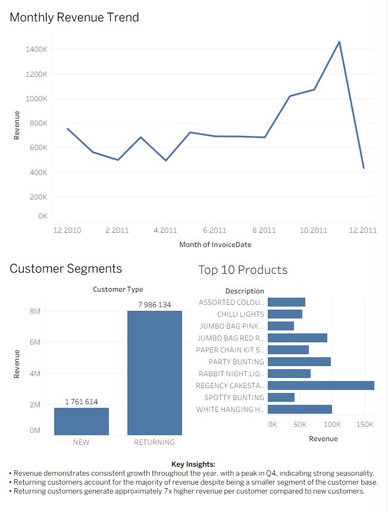

# 🛒 E-Commerce Sales Analysis | SQL + Tableau

> End-to-end sales analysis of an e-commerce retail dataset,
> covering the full analytics workflow: data validation, cleaning,
> exploratory SQL analysis, and an interactive Tableau dashboard.

---
---

## 🛠️ Tools & Stack

| Tool | Purpose |
|------|---------|
| SQL (DBeaver) | Data exploration & cleaning |
| Tableau | Dashboard & visualizations |
| Kaggle | Data source |

**Dataset:** [UCI Online Retail Dataset]((https://www.kaggle.com/datasets/ulrikthygepedersen/online-retail-dataset))
**Period covered:** December 2010 – December 2011

---

## 🔄 Workflow

### 1. 🔍 Data Check
- Loaded raw dataset and performed an initial quality audit in SQL
- Assessed completeness, nulls, duplicates, and data types

### 2. 🧹 Data Cleaning
- Removed non-sales line items (e.g. shipping fees, manual adjustments)
- Flagged incomplete months:
  - **December 2010** — dataset starts mid-month
  - **December 2011** — dataset ends mid-month

> ⚠️ These partial months are critical for correct trend interpretation
> and were excluded from certain calculations.

### 3. 📈 Sales Trend Analysis
- Analyzed monthly revenue across the full period
- Identified consistent growth throughout 2011 with a strong Q4 peak

### 4. 📦 Top Products
- Ranked products by revenue to surface bestsellers
- Uncovered non-product entries during this step,
  requiring an additional cleaning pass

### 5. 👥 Customer Segmentation
- Split customers into **NEW** vs **RETURNING** segments
- Calculated total revenue, customer count,
  and revenue per customer for each group

---

## 💡 Key Insights

### 📈 Insight 1 — Strong Seasonality
Revenue shows consistent growth throughout the year with a clear
**Q4 peak**, indicating high business seasonality.

---

### 📉 Insight 2 — Data Quality Matters
The apparent revenue drop in December 2011 is **an artifact of
incomplete data** — the month is not fully covered by the dataset.
This highlights the importance of validating data before drawing
conclusions.

---

### 📦 Insight 3 — Product Catalogue Hygiene
Top product analysis revealed **non-sales entries** (e.g. shipping
costs) embedded in the data, requiring additional filtering to ensure
accurate revenue attribution.

---

### 👥 Insight 4 — Retention Drives Revenue
Despite acquiring **more new customers**, returning customers account
for over **80% of total revenue** and generate approximately
**7x more revenue per customer**.

| Segment | Customers | Total Revenue | Avg. Revenue / Customer |
|---------|-----------|---------------|------------------------|
| New | 4,339 | ~$1.85M | ~$427 |
| Returning | 2,844 | ~$8.82M | ~$3,100 |

> Returning customers represent ~40% of the customer base
> but drive ~83% of total revenue — making retention
> the single most valuable growth lever for this business.

---

## 📊 Dashboard

The Tableau dashboard includes:
- **Monthly Revenue Trend** — growth pattern and seasonality
- **Customer Segments** — NEW vs RETURNING revenue comparison
- **Top 10 Products** — bestsellers by total revenue

---

## 💼 Business Recommendations

The business demonstrates strong customer acquisition, but the
**real value lies in retention**:

- 🔁 Invest further in customer retention programmes
- 🎁 Introduce a loyalty/rewards scheme for returning customers
- 📬 Use returning customer behaviour to build re-engagement
  campaigns targeting churned buyers

---

